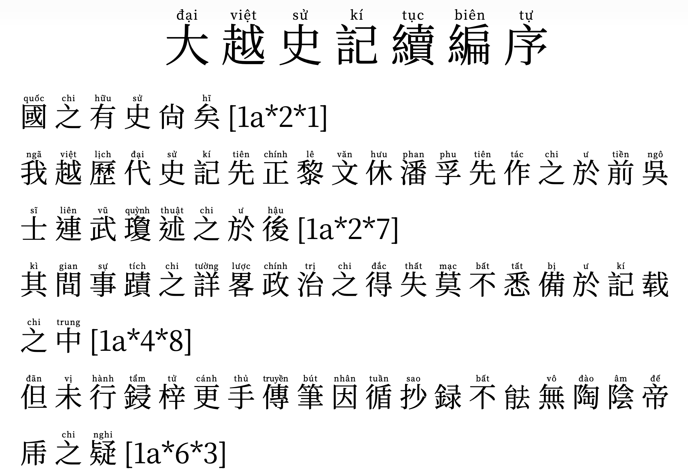

# Sino Nom Fonts - Font chữ phiên âm Hán Nôm

Font chữ hiển thị **phiên âm Hán Việt / Hán Nôm** trực tiếp trên chữ Hán - Nôm, giúp người dùng **đọc hiểu chữ Hán Nôm mà không cần biết trước**.

👉 Phù hợp cho:
- Người học Hán Nôm
- Người nghiên cứu lịch sử Việt Nam
- Người muốn đọc văn bản cổ (Đại Việt sử ký, văn bia, sách cổ…)

---

  
  
  

## 🧠 Sino Nom Fonts là gì?

Sino Nom Fonts là dự án font chữ giúp:

- Hiển thị **chữ Hán + phiên âm Hán Việt**
- Đọc được văn bản Hán Nôm ngay lập tức
- Không cần học chữ trước

👉 Đây là một bước tiến giúp **phổ cập Hán Nôm cho cộng đồng**

## 🖼️ Xem trước

  

📄 [Xem PDF Đại Việt sử ký tục biên tự](./sample/dvsktbt.pdf)

- Hiển thị:
  - Chữ Hán / chữ Nôm
  - Phiên âm Hán Việt ngay phía trên

- Giúp:
  - Đọc văn bản cổ dễ dàng
  - Học chữ nhanh hơn
  - Hiểu nội dung mà không cần biết chữ Hán

- Hỗ trợ:
  - Hán cổ
  - Hán Nôm Việt Nam

---

## 🔍 Ứng dụng thực tế

- Đọc sách cổ: *Đại Việt sử ký toàn thư*
- Học Hán Việt cơ bản
- Nghiên cứu văn bia, thần tích
- Làm phụ đề, tài liệu học tập

---

## 🎯 Mục tiêu dự án

- Giúp bất kỳ ai cũng có thể đọc được chữ Hán - Nôm
- Bảo tồn và phổ biến Hán - Nôm Việt Nam
- Xây dựng bộ dữ liệu mở (open dataset)
- Phát triển công cụ học Hán Việt hiện đại

---

## 🤝 Đóng góp dữ liệu

Dự án phát triển dựa trên đóng góp cộng đồng.

### Cách đóng góp:

1. Fork repository  
2. Sửa file: data/datas.txt
3. Thêm dữ liệu mỗi dòng 1 chữ với cấu trúc: {tự} {phiên âm}
4. Tạo Pull Request trên GitHub

---

## 💖 Tài trợ

Nếu bạn thấy dự án có ý nghĩa, bạn có thể:

- 📚 Đóng góp dữ liệu  
- 🧑‍💻 Đóng góp code  
- 💸 Tặng tôi một tách cafe nhỏ

  

---

## ❓ FAQ

### Font này dùng để làm gì?

Giúp đọc chữ Hán Nôm thông qua phiên âm Hán Việt.

### Có cần biết chữ Hán không?

Không. Font hiển thị phiên âm trực tiếp.

### Có thể dùng cho học tập không?

Rất phù hợp cho:
- học sinh
- sinh viên
- người nghiên cứu

---

hán nôm, chữ hán việt, font hán nôm, học hán việt, đọc chữ hán, phiên âm hán việt, sino nom, chữ nôm việt nam, từ điển hán việt, học chữ hán cơ bản